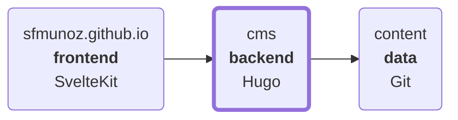

# CMS

Content Management System

- [References](#references)
- [Architecture](#architecture)
- [Development](#development)

## References

- https://gohugo.io/configuration/ + `hugo config`: configuration reference
- https://gohugo.io/
- https://github.com/gohugoio/hugo

## Architecture



## Development

Standalone server:

```
$ hugo server -D --disableFastRender --noHTTPCache -t standalone
```

Options:

```
$ hugo server -h
(...)
Flags:
(...)
  -D, --buildDrafts        include content marked as draft
(...)
  --disableFastRender      enables full re-renders on changes
(...)
  --noHTTPCache            prevent HTTP caching
(...)
  -t, --theme strings      themes to use (located in /themes/THEMENAME/)
(...)
```
