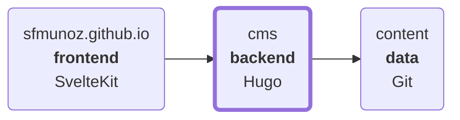

# CMS

Content Management System

- [References](#references)
- [Architecture](#architecture)
- [Development](#development)
- [Build](#build)

## References

- https://gohugo.io/configuration/ + `hugo config`: configuration reference
- https://gohugo.io/
- https://github.com/gohugoio/hugo

## Architecture



## Development

Run **hugo server** using default **headless** theme:

```
$ ./run.sh
+ rm -rf public
+ hugo server -D --disableFastRender --noHTTPCache
(...)
```

Run **hugo server** using default **standalone** theme:

```
$ HUGO_THEME=standalone ./run.sh
+ rm -rf public
+ hugo server -D --disableFastRender --noHTTPCache
```

Options (**run.sh** sets **HUGO_THEME** environment variable instead of **-t/--theme** command line argument):

```
$ hugo server -h
(...)
Flags:
(...)
  -D, --buildDrafts        include content marked as draft
(...)
  --disableFastRender      enables full re-renders on changes
(...)
  --noHTTPCache            prevent HTTP caching
(...)
  -t, --theme strings      themes to use (located in /themes/THEMENAME/)
(...)
```

## Build

Default **HUGO_THEME=headless**:

```
$ ./build.sh
+ rm -rf public
+ hugo build --gc --minify --panicOnWarning
(...)
```

Use **HUGO_THEME=standalone**:

```
HUGO_THEME=standalone ./build.sh
+ rm -rf public
+ hugo build --gc --minify --panicOnWarning
(...)
```
